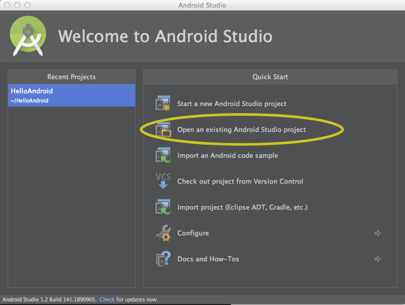

# HelloAndroid
Android realtime chat example project.

## Quick Start

* Install [Android Studio 1.2](http://developer.android.com/tools/studio/index.html) if you don't currently have it installed.  
* Clone this project
* Launch Android Studio and cllick "Open An existing Android Studio Project"

   
